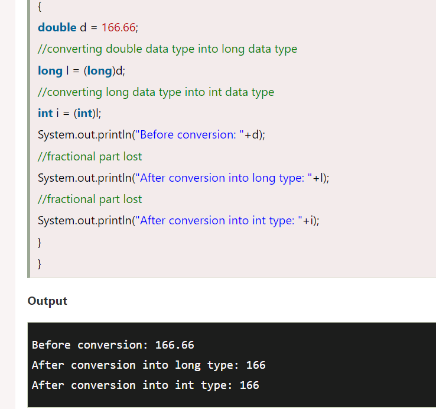
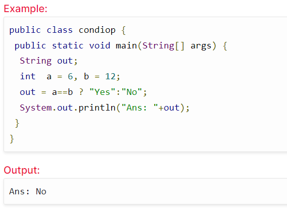
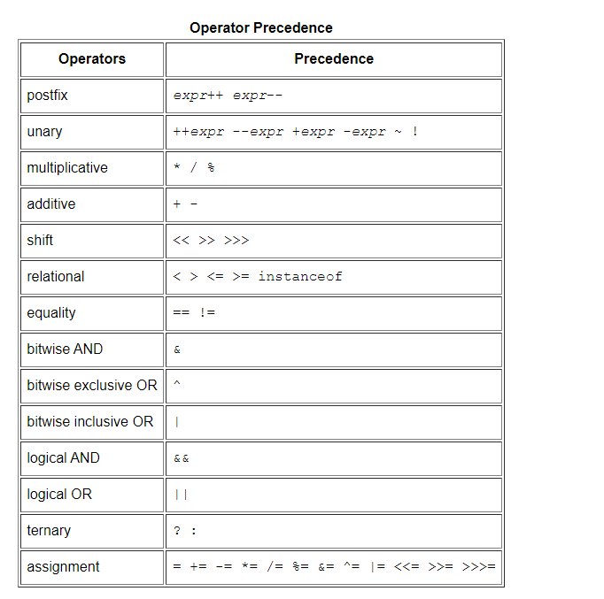

# Certification Exams Java Foundations Exam Number: 1Z0-811

## Describe the features of Java
1. Simple  Java is easy to learn and its syntax is quite simple, clean and easy to understand.The confusing and ambiguous concepts of C++ are either left out in Java or they have been re-implemented in a cleaner way.

Eg : Pointers and Operator Overloading are not there in java but were an important part of C++.

2. Object Oriented
   In java, everything is an object which has some data and behaviour. Java can be easily extended as it is based on Object Model. Following are some basic concept of OOP's.

- Object
- Class
- Inheritance
- Polymorphism
- Abstraction
- Encapsulation
3. Robust
   Java makes an effort to eliminate error prone codes by emphasizing mainly on compile time error checking and runtime checking. But the main areas which Java improved were Memory Management and mishandled Exceptions by introducing automatic Garbage Collector and Exception Handling.

4. Platform Independent
   Unlike other programming languages such as C, C++ etc which are compiled into platform specific machines. Java is guaranteed to be write-once, run-anywhere language.

On compilation Java program is compiled into bytecode. This bytecode is platform independent and can be run on any machine, plus this bytecode format also provide security. Any machine with Java Runtime Environment can run Java Programs.

Java is platform Independent Language

5. Secure
   When it comes to security, Java is always the first choice. With java secure features it enable us to develop virus free, temper free system. Java program always runs in Java runtime environment with almost null interaction with system OS, hence it is more secure.

6. Multi Threading
   Java multithreading feature makes it possible to write program that can do many tasks simultaneously. Benefit of multithreading is that it utilizes same memory and other resources to execute multiple threads at the same time, like While typing, grammatical errors are checked along.

7. Architectural Neutral
   Compiler generates bytecodes, which have nothing to do with a particular computer architecture, hence a Java program is easy to intrepret on any machine.

8. Portable
   Java Byte code can be carried to any platform. No implementation dependent features. Everything related to storage is predefined, example: size of primitive data types

9. High Performance
   Java is an interpreted language, so it will never be as fast as a compiled language like C or C++. But, Java enables high performance with the use of just-in-time compiler.

10. Distributed
    Java is also a distributed language. Programs can be designed to run on computer networks. Java has a special class library for communicating using TCP/IP protocols. Creating network connections is very much easy in Java as compared to C/C++.

## components of a basic Java program

Java Platform
Java platform is a software or collection of programs that help us to execute applications written in Java programming language. A Java platform consists of a Java compiler, a set of libraries, and an execution engine.

Java platform is independent of any particular OS which makes Java programming language a platform-independent language.

Java platform consists of the following components.

### Java language:
Java is a programming language that the Java platform use
### The Java Development Kit (JDK)
This is the core component of any Java environment. JDK contains JRE (Java Runtime Environment) along with Java compiler, Java debugger, and other core classes. JDK is used for Java development as it provides the entire executable and binaries as well as tools required to compile, debug a Java program.

JDK is a platform-specific software and thus we will have separate JDK installers for each Operating system.
### The Java Runtime Environment (JRE):
JRE, as the name suggests, is the runtime environment that is required to execute Java programs and applications. JRE consists of Java Virtual Machine (JVM) and binaries and other classes to successfully execute Java programs
### The Java Compiler:
This is a compiler for Java programming language and its function is to generate Java class files from the Java source code. Java class file contains a platform-independent Java byte code.
### The Java Virtual Machine (JVM):
JVM is the center of Java programming language and Java platform.
The JVM converts the byte code into machine-specific code (also known as object code in other programmer languages).

JVM provides the functionality of garbage collection, memory management,
security, etc. JVM is platform-independent and 
we can customize its functionality using a Virtual interface 
it provides which is not machine-dependent and is also independent of
the operating system.

This platform-independence of JVM allows us to create
Java programs on one machine and execute them on another machine
(WORA – Write – Once – Run – Anywhere).

## Java Package
Package is a collection of related classes. 
Java uses package to group related classes, interfaces and sub-packages in any Java project.
### Types Of Java Package
- Built-in Package: math, util, lang, i/o etc are the example of built-in packages.
- User-defined-package: Java package created by user to categorize their project's classes and interface are known as user-defined packages.
__Every java file must have package in the first of file__

>__package nameOfPackage__;
### Compile and Run your First Java Program
1. crate file with name  that same of the  class name  -using terminal(touch  First.java) -
2. create class with name same to the file name ( public class First)
3. put your code on the class and put the excuted code in main methode
4. to  compile Java programs  use
> javac First.java
5. to run the code
> java First

__if the file in package (directory) for example the name of directory **programFile** the comand ewill be__

> java programFile.First

### import package
> import packageName.ClassName;
- if you want to import all classes
> import packageName.*;

## Type Casting in Java
### Type casting
Convert a value from one data type to another data type is known as type casting.

### Types of Type Casting
There are two types of type casting:

1. __Widening Type Casting or Automatic conversion:__ Converting a lower data type into a higher one is called widening type casting. It is also known as implicit conversion or casting down. It is done automatically. It is safe because there is no chance to lose data. It takes place when

>int x = 7;  

>long y = x;  
//automatically converts the long type into float type

>float z = y;  

> System.out.println("Before conversion, int value "+x);

> System.out.println("After conversion, long value "+y);  

> System.out.println("After conversion, float value "+z);
- Before conversion, the value is: 7
- After conversion, the long value is: 7
- After conversion, the float value is: 7.0
2. __Narrowing Type Casting__ :Converting a higher data type into a lower one is called narrowing type casting. It is also known as explicit conversion or casting up. It is done manually by the programmer. If we do not perform casting then the compiler reports a compile-time error.

##  Java Conditional Operator(ternary operator)
>expression1 ? expression2:expression3;

## String Class
In Java, string is basically an object that represents sequence of char values. An array of characters works same as Java string. For example:
> char[] ch={'j','a','v','a','t','p','o','i','n','t'};

is same as:
> String s="javatpoint";

## ref
- [features-of-java](https://www.studytonight.com/java/features-of-java.php)
- [java-components](https://www.softwaretestinghelp.com/java-components-java-platform-jdk/)
- [package](https://www.studytonight.com/java/package-in-java.php)
- [first-java-program](https://beginnersbook.com/2013/05/first-java-program/)
- [casting](https://www.javatpoint.com/type-casting-in-java)