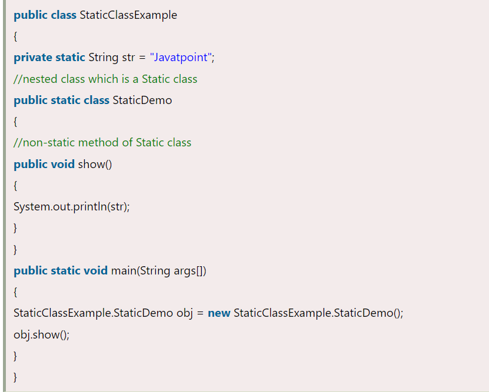
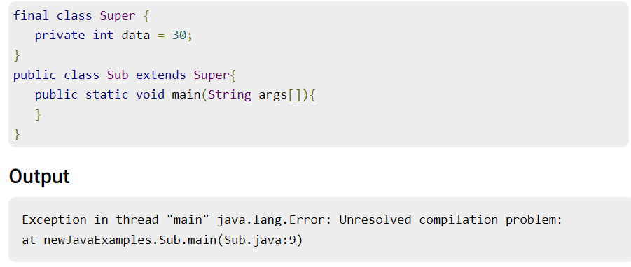

# Types of Classes
## Static Class:
### The properties of the static class are:

- __You cannot use the static keyword with a class unless it is an inner class.__
- It cannot access the member (non-static) of the outer class.
-Only static members of Outer class
      is directly accessible in nested
        static class
> ex 
## Final class
The main purpose of using a class being declared as final is to prevent the class from being subclassed. If a class is marked as final then __no class can inherit any feature from the final class__.
You cannot extend a final class. If you try it gives you a compile time error.

## Abstract Class
An abstract class
is a that is declared with the keyword abstract. The class may or may not contain abstract methods. We cannot create an instance of an abstract class but it can be a subclass. These classes are incomplete, so to complete the abstract class we should extend the abstract classes to a concrete class.

## Concrete Class

Concrete Class
These are the __regular Java classes__. A derived class that provides the basic implementations for all of the methods that are not already implemented in the base class is known as a concrete class. In other words, it is regular Java classes in which all the methods of an abstract class are implemented.
- __In other words, we can say that any class which is not abstract is a concrete class.__

## Singleton Class

A class that has only an object at a time is known as a singleton class. Still, if we are trying to create an instance a second time, that newly created instance points to the first instance.

- Make a constructor private.
- Write a static method that has the return type object of this singleton class. Here, the concept of Lazy initialization is used to write this static method.

## POJO Class
In Java, POJO stands for Plain Old Java Object. A Java class that contains only private variables, setter and getter is known as POJO class. It is used to define Java objects that increase the reusability and readability of a Java program.

## Inner Class

Java allows us to define a class within a class and such classes are known as nested classes. It is used to group the classes logically and to achieve encapsulation
