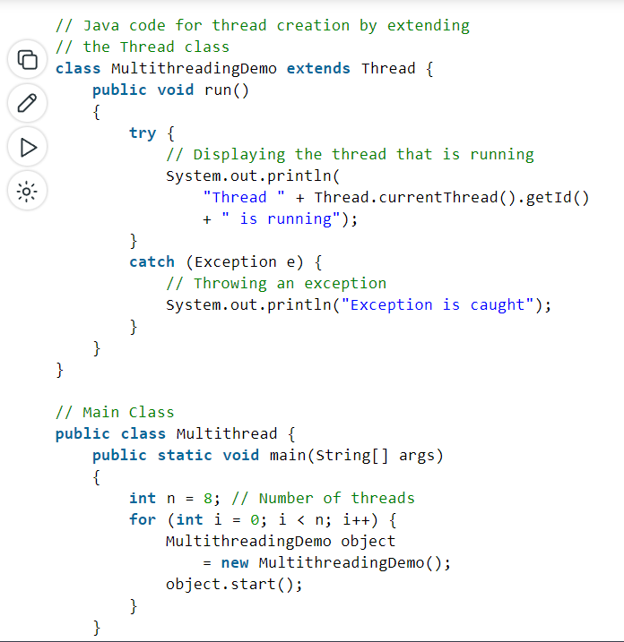
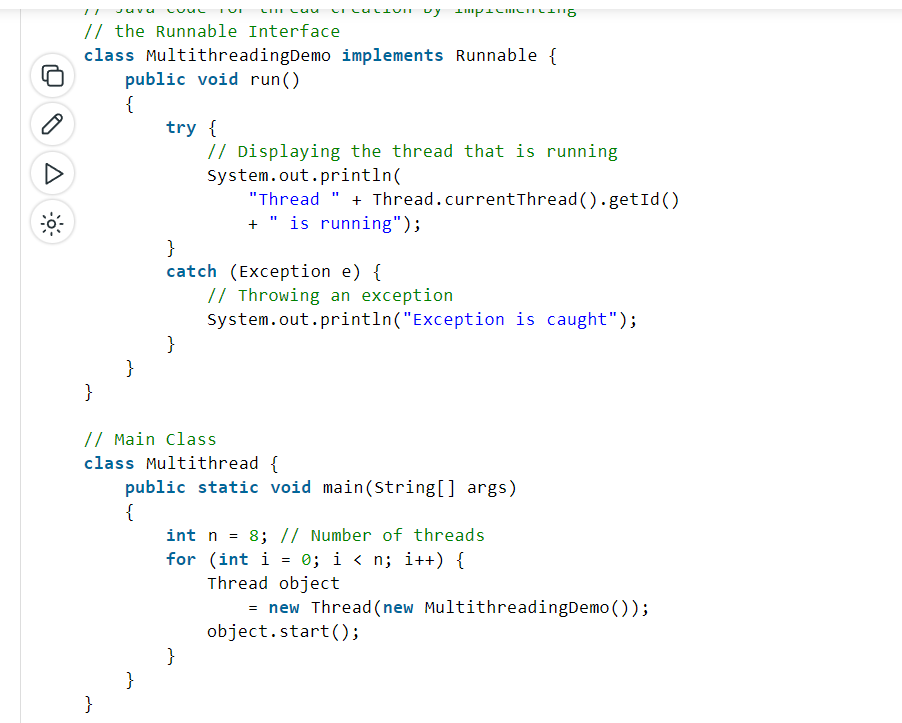

DEC (INT)-> CHAR

# Multithreading in Java
Multithreading is a Java feature that allows concurrent execution of two or more parts of a program for maximum utilization of CPU. Each part of such program is called a thread. So, threads are light-weight processes within a process.

## Threads can be created by using two mechanisms : 

- Extending the Thread class 
)
- Implementing the Runnable Interface
