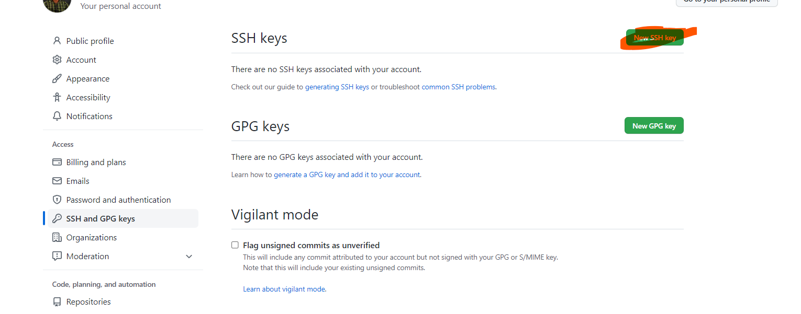

# git and gitHub
## Repository
1. to colone broject from github to git to specific directory __without create new deirectory inside it__
> git clone "Your Repository URL" .

2. if you want to create a new repository in local then push to remote repository:

 ## create ssh (secure shell) by Generate And Test Github Public Key
* 1. Generate Key 
> ssh-keygen -t rsa -b 4096 -C "Your GitHub Email Here"

__cat command is to show the data in file__
* 2. cat the pach
> cat thePachThatTheGitPutTheKeyOnIt

* 3.put the key in githup

* mkdir "Your Directory Name Here"
* git init
* put your work in the directory

__you can use touch file.text  to create file__

__you can use use echo "text sdfsdf" >file.text  // to write on it__

__you can use use cat file.text // to read it__

* git add .

* Commit File
git commit -m "Your Commit Message Here"

* Add Repository
git remote add origin "SSH Repository URL"

 * Example
git remote add origin "git@github.com:OsamaElzero/Course.git"

* Push Data
git push -u origin master

## work in repository

3. if you want to put your work to staging area
> git add file.extention // for spesfic files
>git add . // for all work
 
 3. of you want to get back your work from staging area 
 > git reset

 __or__
 > git restore --staged "File Name Here"

 4. if you want to know what is the stage or level you work
  > git status 

  5. if you want to put your work in repository
  > git commit -m " you'r comments"

6. if you want to see all commits
> git log 

7. if you want to back to any commit
> git reset  --hard commitCode

8. if you want to create new branch
> git checkout -b branchName

9. if you want to checkout to any branch
> git checkout  branchName

10. if you want to delete branch
>git branch-D branchName

11. if you want to Move / Rename Branch
> git branch -m "New Branch Name"

12. If you want to Merge Branch With Current Branch
>git merge "Branch Name You Need To Merge"

13. If you want to push your work to remot repository
> git push origin branchName

14. If you want to pull from remot repository
> git pull 

*or*
> git pull origin branchName

## .gitignore
> touch .gitignore
in this file if you want to ignore push any file have spesific extention
write in this file
> *.log

if you want to exept any file
> !vip.log

if you want to ignore and diretory

>directoryName/

if you want to ignore any file

> text.txt

