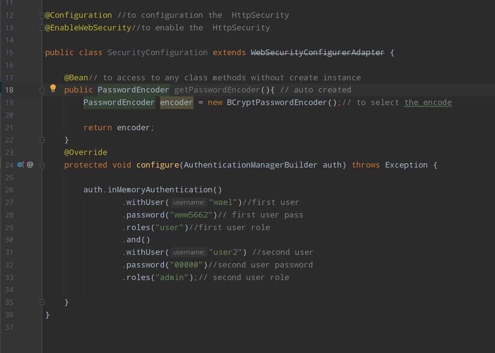

# Spring security
## default behavior of spring security
1. add mandatory authentication for all URLs in app
2. add login form
3. handle login errors
4. create user and genrate password

## security concepts
1. filters:
 In Spring boot, we have filters to filter the HTTP request; filter, in general, is used to intercept the request, i.e. HTTP request and the response from the client-side
This is very useful when we want to restrict any URL to be accessed from the user, and also, we can do many things on the request and response instance in Spring boot.

[learning more about filter](https://www.educba.com/spring-boot-filter/)

1. Authentication :
    - who is this user?
    - the identity of a system user.
    - we can use multi factor authentication(by using sms , email ...)
2. Authorization  :
    -  Is allowed to access to there? , can this user do this?
3. princial :
    - the current logged in user.
    - we use in to prevent multiple login to the same user
4. role
    - what is this user can acces to

 ## start with spring security

1. by adding the dependencies
2. run the application
    - it will generate password (the username: user)
    
3. you can  change the password and username from the __application.properties__

     > server.port=8089

    >spring.security.user.name=wael

    >spring.security.user.password=123456
4. create a new class call it and let it inherit from the spring Security 
__SecurityConfigration extends WebSecurityConfigurerAdapter__
5. @override  void configure(AuthenticationManagerBuilder auth)

6. select  one type of the authentication type  :
    1. userDetailsService
        - in this case you must bulid __userDetailsService__

     
    2. inMemoryAuthentication
        

    

