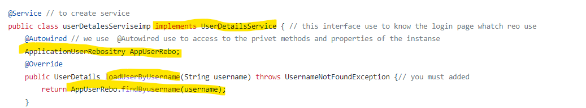
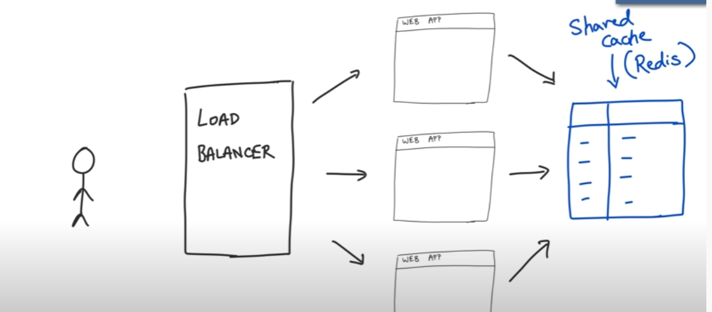

# Spring security
## default behavior of spring security
1. add mandatory authentication for all URLs in app
2. add login form
3. handle login errors
4. create user and genrate password

## security concepts
1. filters:
 In Spring boot, we have filters to filter the HTTP request; filter, in general, is used to intercept the request, i.e. HTTP request and the response from the client-side
This is very useful when we want to restrict any URL to be accessed from the user, and also, we can do many things on the request and response instance in Spring boot.

[learning more about filter](https://www.educba.com/spring-boot-filter/)

1. Authentication :
    - who is this user?
    - the identity of a system user.
    - we can use multi factor authentication(by using sms , email ...)
2. Authorization  :
    -  Is allowed to access to there? , can this user do this?
3. princial :
    - the current logged in user.
    - we use in to prevent multiple login to the same user
4. role
    - what is this user can acces to

 ## start with spring security

1. by adding the dependencies
2. run the application
    - it will generate password (the username: user)
    
3. you can  change the password and username from the __application.properties__

     > server.port=8089

    >spring.security.user.name=wael // just for testing purposes

    >spring.security.user.password=123456  // just for testing purposes
    ## Authentication
4. create a new class call it and let it inherit from the spring Security 
__SecurityConfigration extends WebSecurityConfigurerAdapter__
5. @override  void configure(AuthenticationManagerBuilder auth)
__this methode is responsible for authentiction__

6. select  one type of the authentication type  :
    1. userDetailsService
        - in this case you must bulid __userDetailsService__

             
    2. inMemoryAuthentication ()
        
__you shouldn't use this way in ecoding password(i use it here just for testing because this way don't encode the password and i can add directly the password- without ecodeing- and the app can read it) The pest bractice like this below__
    
    - best practice for password by ecoding password

7. @EnableWebSecurity //to enable Spring Security’s web security support and provide the Spring MVC integration.
8. PasswordEncoder to ecode password for authentication

## Authorization
9. configer Authorization
by @override configure(HttpSecurity http)
    - it use to check the authorization of http requests
    - use to handle auhrize and nun athrize routes
    - to detemin the login and password routes and prosseing
    - to to get access  to rout for user Role or any roule or un Authenticated user
    - you can logout by __/logout__ 
    
## Servlets
- Servlets are the Java programs that run on the Java-enabled web server or application server. They are used to handle the request obtained from the webserver, process the request, produce the response, then send a response back to the webserver. 
- Execution of Servlets basically involves six basic steps: 

    1. The clients send the request to the webserver.
    2. The web server receives the request.
    3. The web server passes the request to the corresponding servlet.
    4. The servlet processes the request and generates the response in the form of output.
    5. The servlet sends the response back to the webserver.
    6. The web server sends the response back to the client and the client browser displays it on the screen.

        
- the filter can do any any processing and  manbulate request before go to servlet.
- usually the there is maped one to one method between url and servlet (one url for one servlet ) __but filter__ can applied to  avid range of url for example can apypied filter in all url that start __/admin/**__ or  all url .
## Authentication provider
- it responsible for acutal authentication

- it take credentials information (username and password) and return principle( current login  information)

- the sigle application can have multiple authentication stutuges so the sigle application can have __multiple authentication providers__ and these providers work together and the Authentication manager to coordinate them .

- the Authentication Provider need to retrieve the user information  so it will use __userDetailsService__ that returns the user information as object.

    

    

#  JDBC authentication from scratch(Manual UserDetailsService)
-  JDBC or Java Database Connectivity is a Java API to connect and execute the query with the database.
- Architecture-of-JDBC2

    

- you need to to add the dependencies of the JDBC
- Add dependencies of  __H2 DB__  IS Very fast, open source, JDBC API
Embedded and server modes; in-memory databases

- the spring boot APP initialize all sql files (when you add H2 DB)  So:
    1. we create tables  for user schema(the standard JDBC of UserDetailsService)
    
    2. add data to tables(sql files in the app)
    
    3. hadle thee security configuration and add __DataSource__
    

# Spring Security with JPA authentication and MySQL

- add dependencies for :
    1. spring-security
    2. spring data JPA
    3. MySQL Driver
- create web Security Configurer __CLASS__ and extend from webSecurityConfigurerAdapter

- @Override configur __AuthenticationManagerBuilder__
    
    - add password encoder methode note that __@Bean to create methode  return  instance__
        - in case you want to encode the password when add to DB
    - 
    - ansy AuthenticationManagerBuilder need to provider and the provider need __userDetailsService__ to load user by username
    
    

- @Override configur __HttpSecurity__
    - 
- @Autowired userDetailsService __note that we use  @Autowired use to access to the privet methods and properties of the instanse htat autowired__

    > @Autowired

    > UserDetailsService userDetailsService;

-  create  class for user 
    - let the users class implements UserDetails
    - make the enable and other @override methods return true
    - create user properties of the the user __you have to create the properties for username and password__
    -__@Entity // to crate table for this class__
    
    __if you want to add Roles and Lock , expired..ect , you can do that for proles like in exaple below and for other @overide methode you can add properties and call it in the methodes__
    
- create repository to make query at the entity 
and create method to find user by username 

- create class to implent from  userDetailsService  and  @override method of loadUserByUsername to retern the the instance of user __the class of user instance that the loadUserByUsername method returned have to inherit from userDetails__

- In web Security Configurer CLASS add the configer(httpSecurity)
    - .hasAuthority() method is call the __getAuthorities()__ in userDetails entity

- open database and create new database and name it for example __examsys__
- go to application.properties and configure properties
>server.port=8081 #port of server

> spring.datasource.url=jdbc:mysql://localhost:3306/examsys  #the local  url for msql database  and the name of it examsys

> spring.datasource.username=root    # database username

> spring.datasource.password=        # database passwoer

>spring.jpa.hibernate.ddl-auto=update  # the data in database

## summary
 you must build
 1.  class for users as @entity and inherit it from userDetails and make all @override true  and if you need to roules  you can use getAuthorities() method, and in entity must have username and password __you can use email as username by make the @override getUsername() method retern it.
 2. Repository and bulid methode to find by username 
 3. UserDetailsService to load By username by call the findByUsername method from repository
 4. create webSecurityConfigureration and inherit from webSecurityConfigurerAdapter and @override configur(httpSecurity) for otherizations and @override configur(AuthenticationManagerBuilder) for Authentication . 

 5. create new database  and  configure properties of application.properties and 

# LDAP Authentication
## what is LDAP 
- LDAP : Lightweight directory access protocol (LDAP) is a protocol that makes it possible for applications to query user information rapidly.
-  accessing and maintaining distributed directory information services over an Internet Protocol (IP) network.
- The common use of LDAP for stor thr Organization information
- can provide that solution by allowing Organization to store and access employee contact information in a central location. Businesses can save time and money by using an LDAP server while improving employee communication.

- Someone within your office wants to do two things: Send an email to a recent hire and print a copy of that conversation on a new printer. LDAP (lightweight directory access protocol) makes both of those steps possible.

## How LDAP works?
An LDAP query typically involves:

1. Session connection. The user connects to the server via an LDAP port. 
1. Request. The user submits a query, such as an email lookup, to the server. 
1. Response. The LDAP protocol queries the directory, finds the information, and delivers it to the user. 
1. Completion. The user disconnects from the LDAP port.

## build LDAP Authentication with spring security
1. add dependencies of LDAP server and spring security

        <dependency>
			<groupId>org.springframework.ldap</groupId>
			<artifactId>spring-ldap-core</artifactId>
		</dependency>

    	<dependency>
			<groupId>org.springframework.security</groupId>
			<artifactId>spring-security-ldap</artifactId>
		</dependency>

		 < dependency>
			< groupId>com.unboundid</groupId>
			<artifactId>unboundid-ldapsdk</artifactId>
			<version>4.0.14</version>
			<scope>runtime</scope>
		</dependency>
1. Add ldap-server file 
     1.  create __ldap-server.ldif__ in resources
     2.  put user data on it:
      >
      - uid: user id
      - ou : organisation unit
      - dc:domain component
      > 
      - dn: uid=bob,ou=people,
      - dc=springframework,dc=org
      - objectclass: top
      
    - objectclass: person
    - objectclass: organizationalPerson
    - objectclass: inetOrgPerson
    - cn: Bob Hamilton
    - sn: Hamilton
    - uid: bob
    - userPassword: bobspassword

1. Configure the LDAP in application.properties
by adding the following
 > 
- spring.ldap.embedded.port = 8389 # the port of LDAP
- spring.ldap.embedded.ldif = classpath:ldap-server.ldif  #the namr of file
- spring.ldap.embedded.base-dn = dc=springframework,dc=org   #the head of data in the file
1. create class for securityConfigration extend from webSecurityConfigurerAdapter
    1. override http configur  methode
        
    2. override AuthenticationManagerBuilder configur methode

# JWT 
- JWT (json-web-tokens)
- __HTTP protocol is stateless that means 
every HTTP request the server receives is independent and does not relate to requests that came prior to it__
- so because http is stateless you should send security credentials on eash request
# Authorization Stutuges
## Session token
- Session Authentication
A session is a small file, most likely in JSON format, that stores information about the user, such as a unique ID, time of login and expirations, and so on. It is generated and stored on the server so that the server can keep track of the user requests. The user receives some of these details, especially the ID, as cookies that will be sent with every new request, so that the server can recognize the ID and authorize the user’s requests.

- Working
    1. The user sends a login request to the server.
    2. The server authenticates the login request, __sends a session to the database, and returns a cookie containing the session ID__ to the user.
    3. Now, the user sends new requests (with a cookie).
    4. The server checks in the database for the ID found in the cookie, if the ID is found it sends the requested pages to the user.

- if you don't use CORS protection you'r website  exposed to attack with __CSRF  vulnerability__
and you can handle this vulnerability [unti CSRF ](https://knowledge-base.secureflag.com/vulnerabilities/cross_site_request_forgery/cross_site_request_forgery_php.html)

- if you have multi server you can face aproblem when you change from server to another server

the solution is

## json- web-token

 - working
    1. Server generates an "accessToken", encrypting the "userId" and "expiresIn", with the ACCESS_TOKEN_SECRET, 
and sends the "accessToken" to the browser (client side).
    2. The browser (client side) receives the "accessToken" and saves it on the client side.
    3. The "accessToken" is included in every subsequent request to the server

 
- JWT Structure
    - JWT consists of __three parts__ serprated by points
   

    1. header 
        - it contains __encrypting base64__
 json data that contains the algorithm of hashing the signature and the type
    2. PAYLOAD
        - in containe s __encrypting base64__
    
 json data that contains the data that need no used like uername and the name of user
       - don't put and secret data because you can decode and see the data
    3. Structure
    - It contains from hashing code (code you can't decode it) 
    

# Bulid JWT from secratch
1. create project add put the dependencies of spring web and security
2. add dependencies of JWT
    > 	<dependency>
			<groupId>io.jsonwebtoken</groupId>
			<artifactId>jjwt</artifactId>
			<version>0.9.1</version>
		</dependency>
		<dependency>
			<groupId>javax.xml.bind</groupId>
			<artifactId>jaxb-api</artifactId>
			<version>2.3.0</version>
		</dependency>
3. Add the class of web configure and extend from webSecurityConfigurerAdapter
4. Override http configure method
5. override AuthenticationManagerBuilder configur  methode
6. Autowired userDetailsService after building it
7. Been passwordEncoder
8.  [code from here](https://github.com/koushikkothagal/spring-security-jwt)
        

