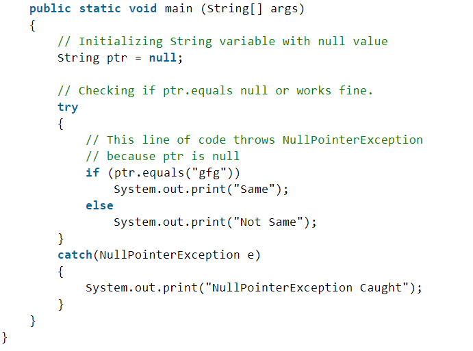
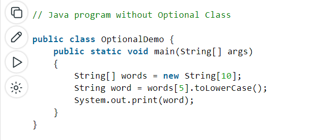

# java 8

## Optional Class
in the first we will talk about the problem that the __Optional class__ solve it 

### NullPointerException
- NullPointerException is thrown when program attempts to use an object reference that has the null value.
These can be: 
 
    1. Invoking a method from a null object.
    2. Accessing or modifying a null object’s field.
    3. Taking the length of null, as if it were an array.
    4. Accessing or modifying the slots of null object, as if it were an array.
    5. Throwing null, as if it were a Throwable value.
    6. When you try to synchronize over a null object.
- examples:

