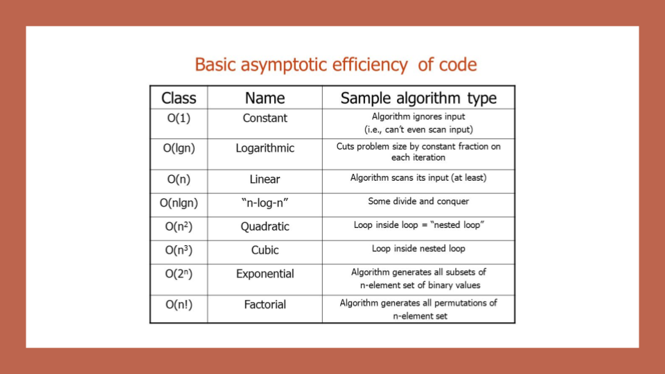

## BIG O

It is notation  to evaluate the efficiency of an algorithm or method  that use to achieve to goal of  and it the worst case analysis function it based on:

Running Time (time efficiency/complexity)

And it’s known as time efficiency or time complexity which means the amount of time that the method/function or the code took to complete.

Memory Space 
And it’s known as space efficiency or time complexity which means the amount of memory  that the method/function used and stor data on it.

The big omga :the  best case of algorithm efficiency analysis .

Big Theta: the Average Case represents the tight bound of Time and Space.

n:  is refer to the input size

Big o to for  o(n)

Big O to for in for O(n^2)

                                                                                        photo 1

What is a Linked List?

A Linked List is a series of connected  Nodes to each other and there are two type of it Singly and Doubly.

Each node  consist from value and pointer .

The head point to the first node in the liked list and each node point to the next node  and the final node point to to null

                                 
                                                                                           photo 2 

If we went to add a node in the fist

photo3

 we must transfer the head from the first node to the new node and make the pointer of new node point to the old-first node

and the pointer of  old- first node point to the next node.

photo 4

Notes :
photo 1 quoted from ref [1]
photo 2&3&4 quoted from ref [2]

: references

1-[1](https://codefellows.github.io/common_curriculum/data_structures_and_algorithms/Code_401/class-05/resources/big_oh.html)

2-[2](https://codefellows.github.io/common_curriculum/data_structures_and_algorithms/Code_401/class-05/resources/singly_linked_list.html)

